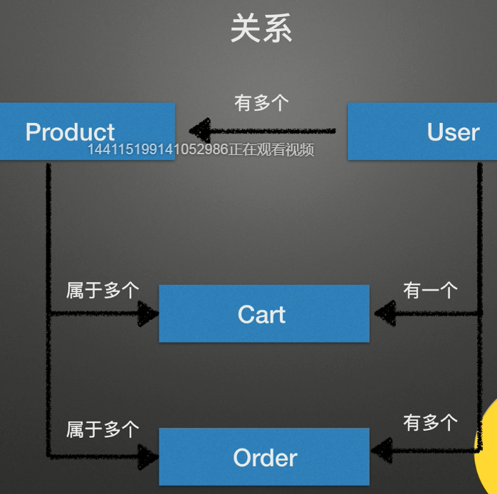

# Node.js前言

- 解决服务器高并发性能问题：事件驱动，异步IO
- 缩短发送到响应的时长：
  - 发送请求快些 （不可控，客户端网速）
  - 接受请求快些 （可控，带宽，CDN）
  - 服务器处理请求快些 （可控，程序，多线程）
- V8引擎 
  - 一款解释执行js的流程虚拟机；嵌入网页解析浏览器JS代码，NodeJS环境解析服务器JS代码
  - 起初用来chrome解析JS脚本
  - 引擎优势：事件驱动机制 编译和快速执行效率 没有同步IO


# Node.js简介

**Node.js是一个让js运行在服务器端的开发平台**

- 功能类似其他后端语言，和系统进行交互
- 不是独立的语言 Node.js用js编程，运行平台是包装后的js引擎v8
- 轻量架构 不用运行在类似apache,nginx的服务器软件上


**Node.js特点**

- 单线程
  - 减少内存开销 ；java,php等语言，会为每一个客户创建一个新的线程，每个线程2MB；Node.js有用户连接，触发内部事件，非阻塞I/O，事件驱动机制，让Node.js并行（放入事件栈）
  - I/O阻塞，整个线程阻塞
- 非阻塞IO
  - 传统单线程，线程暂停等待数据返回后才继续执行；
  - Node.js采用非阻塞I/O，访问数据库之后，立即执行后面的代码，返回结果放入回调
  - 某个I/O执行完毕，事件形式通知执行I/O操作的线程，事件执行回调函数。为处理异步I/O，线程有事件循环机制
  - 阻塞模式，一个线程只能处理一项任务，提高吞吐依靠多线程；非阻塞模式，一个线程CPU利用率100%，永远执行操作。（人多，还多人闲着，不如一个人玩命干）
- 事件驱动
  - 回调函数 磁盘I/O 网络通信 数据库查询 加入事件环。。。回调函数->事件循环 
  - 新用户请求，还是老用户I/O完成，都要以事件方式加入事件环，等待调度
  - 所有I/O都是异步，都是回调函数嵌套回调


# Node.js应用

**特点擅长I/O，不擅长计算**

- 数据库读写，读写文件，websocket，就是对数据输入输出

- > 你开了一家客栈，雇了5个伙计。每当客人来，就选一个伙计全程招待客人，一对一服务，直至客人离店。此时客栈最多同时接待5个客人。
  >
  > 于是亏损了。
  >
  > 你又开了一家客栈，还是雇了5个伙计，但是换了经营策略。每个伙计不再对客人贴身服务，而是按顺序满足每一位客人的需求，然后转而服务下个客人。现在客栈最多同时接待的人数为客栈容量上限。
  >
  > 这样成本不变，赚的钱又多，好开心。
  >
  > 前者是Java，后者是Node。Java用多线程处理并发，Node用异步处理并发。

- 擅长的是任务调度，业务有很多CPU计算，相当于阻塞了I/O，不适合Node.js

- 程序需要处理大量I/O并发，向客户端响应之前，不需要做负责处理，Node.js合适；适合跟websocket配合，实时交互

  

**异步**

- callback

- promise

- generator co

- async await

  

**适用场景**

- express/koa web
- im即时聊天 socket.io
- api（移动端，pc，h5）
- HTTP Proxy （taobao，Qunar，Tencent都有）
- 前端构建工具（grunt,gulp,webpack）
- 跨平台打包工具（pc electron,微信小程序,ionic framework）
- 操作系统 命令行 反向代理 编辑器


# 数据库

**关系数据库vs非关系数据库**

1.node使用数据库

npm i mysql2 -S

```javascript
//utils/database.js
const mysql = require('mysql2');
const pool= mysql.createPool({
    host:'localhost',
    user:'root',
    database:'test',
    password:'weizai'
})

module.exports = pool.promise();

//app.js
const db = require('./utils/database');
db.execute('select * from products').then(res=>{
	console.log(res);
}).catch(err=>{console.log(err)})

```


**Sequelize**

ORM框架 对象关系映射

模型 实例 查询 关系 sequelize

>1.连接数据库
>
>```javascript
>const sequelize = new Sequelize('database','username','password',{  dialect: "mysql",host:"localhost"})
>```
>
>2.测试连接
>
>```javascript
>sequelize
>.authenticate()
>.then(() => {
>console.log('Connection has been established successfully.')
>})
>.catch(err => {
>console.log('Unable to connect to the database', err)
>})
>```
>
>3.创建model
>
>```javascript
>//映射模型表
>const UserModel = sequelize.define('user',{
>id:{
>type:Sequelize.INTEGER(11),
>primaryKey:true,//主键
>autoIncrement:true //自动递增
>},
>username:Sequelize.STRING(100)
>},{
>timestamps:false //不需要自动加入创建更新时间字段
>})
>```
>
>4.根据model自动创建表
>
>```javascript
>sequelize.sync()
>.then(()=>{console.log('ok')})
>.catch(err=>console.log('init error',err));
>```
>
>5.增删查改
>
>```javascript
>//增
>(async ()=>{
>	const user = await UserModel.create({
>		username:'test',
>		password:'test'
>	})
>})()
>//删
>(async ()=>{
>//1
>	const user = await UserModel.destroy({
>		where:{
>  username:'小'
>}
>	})
>//2
>const user = await UserModel.findById(id);
>user.destroy();
>})()
>//查
>(async ()=>{
>//1.查找所有
>const allUser = await UserModel.findAll();
>//2.按照id
>const oneUser = await UserModel.findById(id)/findByPk;
>//3.按照条件
>const someUser = await UserModel.findAll({
>//模糊查询
>where:{
>  name:{$like:'%小%'}
>},
>//精确查找
>password:'root'
>})
>//4.分页查询
>	const size = 10;
>const page = 1;
>const pageUser = await UserModel.findAndCountAll({
>where:{
>  name:{$like:'%小%'}
>},
>limit:size,
>offset:size*(page-1)
>})
>})()
>//改
>(async ()=>{
>//1 data带id
>await UserModel.update(data)
>//2
>const user = await UserModel.findById(id)
>	user.update(data)
>})()
>```
>
>**5.模型关系** 
>
>https://segmentfault.com/a/1190000011583301
>
>http://semlinker.com/node-sequelize-1v1/
>
>http://semlinker.com/node-sequelize-1vm/
>
>```
>//1.一对一 BelongsTo,HasOne
>Player.belongsTo(Team); // 会为Player添加一个teamId 属性以保持与Team 主键的关系
>因为BelongsTo 会在源模型中添加外键，而HasOne 则会在目标模型中添加外键
>
>//2.一对多
>Project.hasMany(User, {as: 'Workers'}) //会向 User 中添加一个projectId或project_id属性。Project 的实例中会有访问器getWorkers 和 setWorkers
>
>//3.多对多
>User.belongsToMany(Project, {through: 'UserProject'});
>//这会创建一个新模型UserProject其中会projectId和userId两个外键
>//getUsers, setUsers, addUser,addUsers to Project, and getProjects, setProjects, addProject, and addProjects
>
>```



不同用户有不同购物车

用户可以在多个订单中


**Mongodb数据库**

非关系型数据库中的关系：Nested / Embedded Documents  References

没有Data Schema	更少的关系（可以嵌套document）

**云mongodb**

1.Atlas -> 2.注册并且进入-> 3.Database Access / Add New User -> 4.选择read and write权限

-> 5.ATLAS / Clusters -> 6.connect -> 7.connect your  applications -> 8.copy connection String


